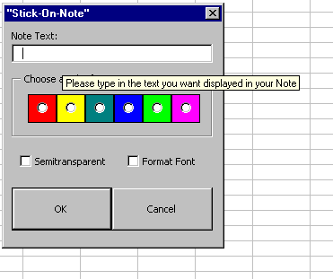



## Excel Stick Note

### Description

It provides a simple little "Sticky-Note" app that inserts a stick note to your excel spreadsheet.
 
### More Info
 
You type in the text you want in your sticky note into the text box. Simple

This code works from your Personal.xls spreadsheet. It has it's own form that will require a reference to "Microsoft Development Enviroment 6.0" to work.

Returns the sticky note

             |
---                |---
**Submitted On**   |2002-06-21 15:26:50
**By**             |[Bob Smith II](https://github.com/Planet-Source-Code/PSCIndex/blob/master/ByAuthor/bob-smith-ii.md)
**Level**          |Advanced
**User Rating**    |4.7 (14 globes from 3 users)
**Compatibility**  |VBA MS Excel
**Category**       |[Microsoft Office Apps/VBA](https://github.com/Planet-Source-Code/PSCIndex/blob/master/ByCategory/microsoft-office-apps-vba__1-42.md)
**World**          |[Visual Basic](https://github.com/Planet-Source-Code/PSCIndex/blob/master/ByWorld/visual-basic.md)
**Archive File**   |[Excel\_Stic973256212002\.zip](https://github.com/Planet-Source-Code/bob-smith-ii-excel-stick-note__1-36083/archive/master.zip)

